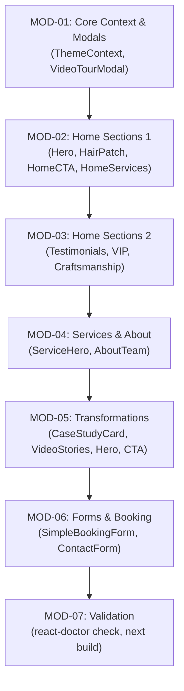

# Implementation Plan: React Doctor Diagnostic Remediation

## Capability & Module Map

| Module ID | Module Name | Scope & Responsibilities | Dependencies |
|---|---|---|---|
| `MOD-01` | **Core Context & Video Modals** | Fix context memoization in `ThemeContext.tsx`, event callbacks in `VideoTourModal.tsx` | None |
| `MOD-02` | **Home Sections (Part 1)** | Fix transitions, keys, accessibility, and state sync in `HairPatchSection.tsx`, `HeroSection.tsx`, `HomeCtaSection.tsx`, `HomeServicesSection.tsx` | `MOD-01` |
| `MOD-03` | **Home Sections (Part 2)** | Fix transitions, callbacks, keys in `TestimonialsSection.tsx`, `VipMembershipsSection.tsx`, `CraftsmanshipSection.tsx` | `MOD-02` |
| `MOD-04` | **Services & About Modules** | Decompose `ServiceHero.tsx`, fix keys, static element interactions, state usage; refactor `AboutTeam.tsx` | `MOD-03` |
| `MOD-05` | **Transformations Module** | Fix keys, transitions, static element interactions, keyboard handlers in `CaseStudyCard.tsx`, `TransformationCta.tsx`, `TransformationsHero.tsx`, `VideoStoriesSection.tsx` | `MOD-04` |
| `MOD-06` | **Forms & Accessibility Hardening** | Modularize `SimpleBookingForm.tsx` (giant component / high complexity / a11y labels / locale formatting), fix `ContactForm.tsx` | `MOD-05` |
| `MOD-07` | **Verification & Score Validation** | Run full `react-doctor` scan, verify target score (100/100), run `npm run build` | `MOD-01` to `MOD-06` |

---

## Phased Execution Strategy

---

## Detailed Module Breakdown

### Module 1: Core Context & Modals
- **Target Files:**
  - `src/context/ThemeContext.tsx`
  - `src/components/VideoTourModal.tsx`
- **Actions:**
  - `ThemeContext.tsx`: Memoize provider value with `useMemo`. Fix state that is only used inside event handlers (`rerender-state-only-in-handlers`).
  - `VideoTourModal.tsx`: Stabilize callback in `useEffect` or use ref pattern to prevent re-subscribing on changing callback (`prefer-use-effect-event`).
- **Verification:** Run `npx react-doctor@latest --verbose` on modified files.

### Module 2: Home Sections (Part 1 - Hero, HairPatch, CTA, Services)
- **Target Files:**
  - `src/components/home/HeroSection.tsx`
  - `src/components/home/HairPatchSection.tsx`
  - `src/components/home/HomeCtaSection.tsx`
  - `src/components/home/HomeServicesSection.tsx`
- **Actions:**
  - `HeroSection.tsx`: Fix missing label association on inputs/selects, replace `transition-all` with targeted transitions, fix missing fragment anchor target (`#booking-form` or equivalent).
  - `HairPatchSection.tsx`: Replace `transition-all`, fix prop-change state reset (`no-reset-all-state-on-prop-change` and `no-adjust-state-on-prop-change`).
  - `HomeCtaSection.tsx` & `HomeServicesSection.tsx`: Replace `transition-all` with specific transitions (`transition-colors`, `transition-transform`).
- **Verification:** Diagnostics cleared for these 4 files.

### Module 3: Home Sections (Part 2 - Testimonials, VIP, Craftsmanship)
- **Target Files:**
  - `src/components/home/TestimonialsSection.tsx`
  - `src/components/home/VipMembershipsSection.tsx`
  - `src/components/home/CraftsmanshipSection.tsx`
- **Actions:**
  - `TestimonialsSection.tsx`: Fix `prefer-use-effect-event` in carousel/timer effect, replace `transition-all`.
  - `VipMembershipsSection.tsx`: Replace array index keys with stable item identifiers.
  - `CraftsmanshipSection.tsx`: Decompose giant component into clean sub-components or modularized render blocks.
- **Verification:** Check diagnostics on these 3 files.

### Module 4: Services & About Modules
- **Target Files:**
  - `src/components/services/ServiceHero.tsx`
  - `src/components/about/AboutTeam.tsx`
- **Actions:**
  - `ServiceHero.tsx`: Break down giant component, replace array index keys with stable keys, replace `transition-all`, fix static element interaction with proper button / key handler, fix state only used in handlers.
  - `AboutTeam.tsx`: Extract duplicate JSX subtrees into reusable team card component.
- **Verification:** Check diagnostics on these 2 files.

### Module 5: Transformations Module
- **Target Files:**
  - `src/components/transformations/CaseStudyCard.tsx`
  - `src/components/transformations/TransformationCta.tsx`
  - `src/components/transformations/TransformationsHero.tsx`
  - `src/components/transformations/VideoStoriesSection.tsx`
- **Actions:**
  - `CaseStudyCard.tsx`: Replace `transition-all` and array index keys.
  - `TransformationCta.tsx` & `TransformationsHero.tsx`: Replace `transition-all` and array index keys.
  - `VideoStoriesSection.tsx`: Replace static element click interactions with accessible button / keyboard handlers, replace array index keys, replace `transition-all`.
- **Verification:** Check diagnostics on Transformations section.

### Module 6: Forms & Booking Hardening
- **Target Files:**
  - `src/components/book-appointment/SimpleBookingForm.tsx`
  - `src/components/contact/ContactForm.tsx`
- **Actions:**
  - `SimpleBookingForm.tsx`:
    - Decompose giant component and high cyclomatic complexity into cohesive step components.
    - Move `Intl` / locale date formatting outside render or memoize it.
    - Fix all 7 label-associated controls and remove placeholder-only labels.
    - Add explicit `aria-label` to custom select/input controls.
  - `ContactForm.tsx`:
    - Pair every `<label>` with `<input id="...">` / `<textarea id="...">`.
    - Provide explicit labels instead of placeholder-only fields.
- **Verification:** Check diagnostics on form files.

### Module 7: Full Validation & Quality Check
- **Actions:**
  - Execute full `npx react-doctor@latest --verbose`.
  - Execute `npm run build` to verify clean build and type safety.
  - Review score progression from 52/100 to 100/100.
