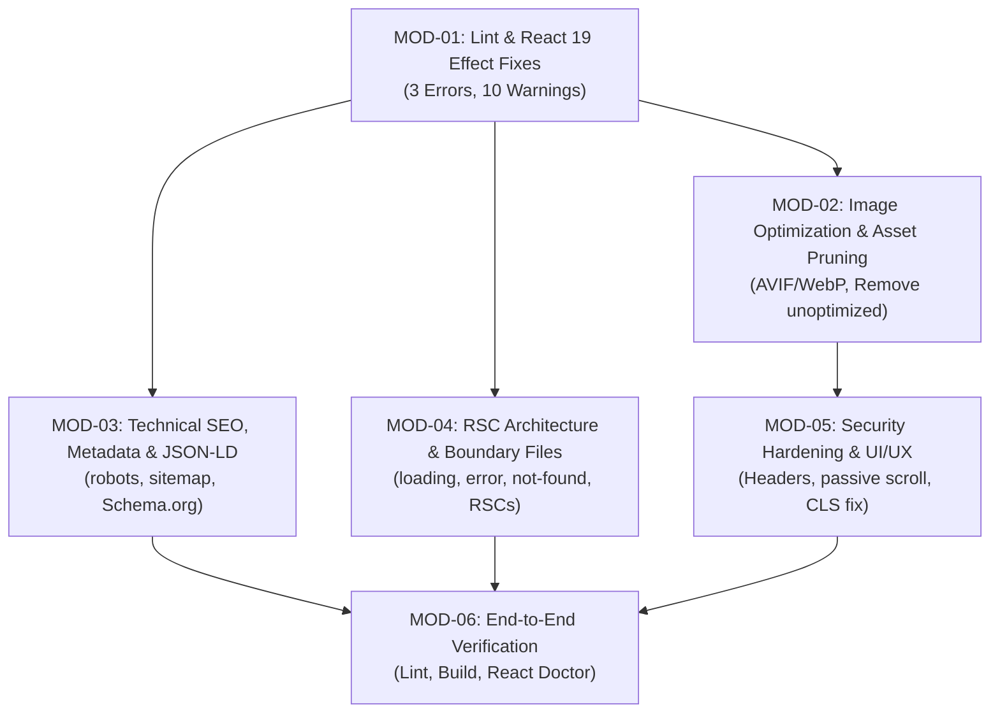

# Implementation Plan: Production-Grade Optimization

This plan outlines the systematic implementation of fixes identified in the audit (`optimize.md`), adhering to the specification in [`tasks/spec.md`](file:///D:/prism/main/Nikhar-salon/tasks/spec.md).

---

## Dependency Graph & Implementation Order



---

## Phase Breakdown

### Phase 1: `MOD-01-LINT-EFFECTS` — React 19 Lint & Cascading Render Fixes
- **Goal**: Clear all 3 errors and 10 warnings from `npm run lint`.
- **Target Files**:
  1. [`src/context/ThemeContext.tsx`](file:///D:/prism/main/Nikhar-salon/src/context/ThemeContext.tsx): Refactor theme initialization to avoid `setThemeState` in `useEffect`. Read saved theme or system preference cleanly with lazy state initializer `useState<Theme>(() => ...)` with SSR safety or pure synchronization.
  2. [`src/components/book-appointment/SimpleBookingForm.tsx`](file:///D:/prism/main/Nikhar-salon/src/components/book-appointment/SimpleBookingForm.tsx): Remove `setService(queryService)` inside `useEffect`; initialize state with query parameters directly using lazy initializers or pure prop defaults.
  3. [`src/components/VideoTourModal.tsx`](file:///D:/prism/main/Nikhar-salon/src/components/VideoTourModal.tsx): Remove `setMounted(true)` inside `useEffect`; rely on pure conditional rendering on `isOpen`. Remove unused imports `Volume2`, `Play`.
  4. [`src/app/contact/page.tsx`](file:///D:/prism/main/Nikhar-salon/src/app/contact/page.tsx): Remove unused imports `Phone`, `Mail`, `MapPin`, `Clock`.
  5. [`src/components/book-appointment/BookingInfoCard.tsx`](file:///D:/prism/main/Nikhar-salon/src/components/book-appointment/BookingInfoCard.tsx): Remove unused import `ShieldCheck`.
  6. [`src/components/home/HairPatchSection.tsx`](file:///D:/prism/main/Nikhar-salon/src/components/home/HairPatchSection.tsx): Remove unused import `useEffect`.
  7. [`src/components/transformations/TransformationsGrid.tsx`](file:///D:/prism/main/Nikhar-salon/src/components/transformations/TransformationsGrid.tsx): Remove unused type import `CaseStudy`.
  8. [`src/components/transformations/VideoStoriesSection.tsx`](file:///D:/prism/main/Nikhar-salon/src/components/transformations/VideoStoriesSection.tsx): Remove unused type import `VideoStory`.
- **Checkpoint**: `npm run lint` exits with code 0 (0 errors, 0 warnings).

---

### Phase 2: `MOD-02-IMAGE-PERF` — High Performance Image Optimization
- **Goal**: Enable Next.js AVIF/WebP image optimization, remove `unoptimized` bypasses, and clean up repository asset bloat.
- **Target Files**:
  1. [`next.config.ts`](file:///D:/prism/main/Nikhar-salon/next.config.ts): Configure image optimization formats:
     ```ts
     images: {
       formats: ['image/avif', 'image/webp'],
       minimumCacheTTL: 31536000,
       // remotePatterns & localPatterns
     }
     ```
  2. [`src/components/about/OwnerProfileSection.tsx`](file:///D:/prism/main/Nikhar-salon/src/components/about/OwnerProfileSection.tsx): Remove `unoptimized` prop from 1.63 MB portrait image. Allow Next.js to convert and deliver responsive AVIF/WebP.
  3. [`src/components/home/HairPatchSection.tsx`](file:///D:/prism/main/Nikhar-salon/src/components/home/HairPatchSection.tsx): Remove `unoptimized` prop from `SafeImage`. Remove inline `<link rel="prefetch">` elements from component JSX.
  4. [`public/images/`](file:///D:/prism/main/Nikhar-salon/public/images/): Remove redundant debug files (`debug_im*.jpg`, `debug_left*.jpg`, `debug_right*.jpg`) and duplicate file `public/images/contact/image.png`.
- **Checkpoint**: `npm run build` generates optimized images without errors.

---

### Phase 3: `MOD-03-SEO-METADATA` — Technical SEO, Sitemaps, & Schema.org JSON-LD
- **Goal**: Full search discovery, crawlability, and rich Local Business snippet display.
- **Target Files**:
  1. [`src/app/robots.ts`](file:///D:/prism/main/Nikhar-salon/src/app/robots.ts): Create standard Next.js robots configuration allowing all crawlers and pointing to `https://nikharsaloon.vercel.app/sitemap.xml`.
  2. [`src/app/sitemap.ts`](file:///D:/prism/main/Nikhar-salon/src/app/sitemap.ts): Create standard Next.js sitemap listing all 6 public routes (`/`, `/about`, `/services`, `/transformations`, `/contact`, `/book-appointment`) with change frequencies and priorities.
  3. [`src/app/layout.tsx`](file:///D:/prism/main/Nikhar-salon/src/app/layout.tsx):
     - Inject Schema.org `BeautySalon` / `HairSalon` JSON-LD structured data with physical address, GPS coordinates, opening hours, phone, and services.
     - Remove redundant manual `<meta property="og:image">` and `<link rel="icon">` tags from `<head>`.
  4. [`src/app/page.tsx`](file:///D:/prism/main/Nikhar-salon/src/app/page.tsx): Add dedicated page `metadata` (Home luxury grooming title, description, canonical, OG).
  5. [`src/app/about/page.tsx`](file:///D:/prism/main/Nikhar-salon/src/app/about/page.tsx): Add dedicated page `metadata` (Story, Master Stylist Firoz Khan, heritage).
  6. [`src/app/services/page.tsx`](file:///D:/prism/main/Nikhar-salon/src/app/services/page.tsx): Add dedicated page `metadata` (25+ service catalog, pricing, haircuts, hair patch).
- **Checkpoint**: Validate sitemap and robots routes build; verify JSON-LD schema syntax.

---

### Phase 4: `MOD-04-RSC-ARCHITECTURE` — RSC Boundaries & Resilience Files
- **Goal**: Minimize client JS bundle by demoting static presentation components to React Server Components and adding standard App Router boundaries.
- **Target Files**:
  1. Remove `'use client'` from:
     - [`src/components/Logo.tsx`](file:///D:/prism/main/Nikhar-salon/src/components/Logo.tsx)
     - [`src/components/about/AboutHero.tsx`](file:///D:/prism/main/Nikhar-salon/src/components/about/AboutHero.tsx)
     - [`src/components/book-appointment/BookAppointmentHero.tsx`](file:///D:/prism/main/Nikhar-salon/src/components/book-appointment/BookAppointmentHero.tsx)
     - [`src/components/book-appointment/BookingInfoCard.tsx`](file:///D:/prism/main/Nikhar-salon/src/components/book-appointment/BookingInfoCard.tsx)
     - [`src/components/transformations/TransformationsHero.tsx`](file:///D:/prism/main/Nikhar-salon/src/components/transformations/TransformationsHero.tsx)
     - [`src/components/transformations/TransformationCta.tsx`](file:///D:/prism/main/Nikhar-salon/src/components/transformations/TransformationCta.tsx)
  2. Delete dead orphaned components:
     - `src/components/AppointmentModal.tsx`
     - `src/components/common/BeforeAfterSlider.tsx`
  3. Create App Router boundary files:
     - `src/app/loading.tsx`: Luxury pulsing placeholder for page transitions.
     - `src/app/error.tsx`: Elegant client error fallback with reset option.
     - `src/app/not-found.tsx`: Custom branded 404 page with navigation links.
  4. [`src/components/contact/ContactHero.tsx`](file:///D:/prism/main/Nikhar-salon/src/components/contact/ContactHero.tsx) & [`VideoStoriesSection.tsx`](file:///D:/prism/main/Nikhar-salon/src/components/transformations/VideoStoriesSection.tsx): Dynamically import `VideoTourModal` using `next/dynamic` to avoid shipping modal code on initial render.
- **Checkpoint**: Client bundle size reduced; error and 404 boundaries function seamlessly.

---

### Phase 5: `MOD-05-SECURITY-UX` — Security Hardening & UI Polish
- **Goal**: Prevent tech fingerprinting, add security headers, and resolve layout shift.
- **Target Files**:
  1. [`next.config.ts`](file:///D:/prism/main/Nikhar-salon/next.config.ts):
     - Set `poweredByHeader: false`.
     - Configure security headers (`X-Content-Type-Options: nosniff`, `X-Frame-Options: SAMEORIGIN`, `Referrer-Policy: strict-origin-when-cross-origin`, `Permissions-Policy`).
  2. [`src/components/Navbar.tsx`](file:///D:/prism/main/Nikhar-salon/src/components/Navbar.tsx): Add `{ passive: true }` to `window.addEventListener('scroll', handleScroll)`.
  3. [`src/components/home/TestimonialsSection.tsx`](file:///D:/prism/main/Nikhar-salon/src/components/home/TestimonialsSection.tsx): Eliminate `isDesktop` layout shift by using responsive CSS classes for carousel visibility rather than JavaScript window resize state.
  4. [`src/components/transformations/VideoStoriesSection.tsx`](file:///D:/prism/main/Nikhar-salon/src/components/transformations/VideoStoriesSection.tsx): Convert thumbnail `div role="button"` to semantic `<button type="button">`.
- **Checkpoint**: Security headers verified; 0 scroll performance warnings.

---

### Phase 6: `MOD-06-VALIDATION` — Final End-to-End Verification
- **Goal**: Prove 100% compliance across all tools.
- **Commands**:
  1. `npm run lint` &rarr; 0 errors, 0 warnings.
  2. `npm run build` &rarr; Successful static compilation of all routes + sitemap/robots.
  3. `npx react-doctor@latest --verbose` &rarr; 100 / 100 score.
